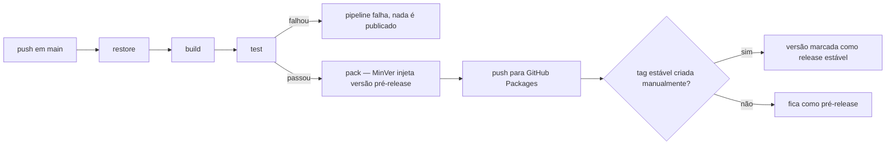

# Publicação versionada de pacotes Limaj.Framework.* (feed + pipeline)

**Status:** Em andamento
**Última revisão:** 2026-09-13

## Contexto

Hoje `packages/Limaj.Framework.*` não tem nenhum mecanismo de distribuição: nenhum `.csproj`
declara `PackageId`/`GeneratePackageOnBuild`, não há `nuget.config`, e não há workflow de
CI/CD real no root do repositório (os workflows sob `template-backend/.github/workflows/` são
placeholders `echo "TODO"`, escopados a um produto copiado do template, não ao framework em
si). O único produto real construído a partir deste framework (`FinanceFlow`) não referencia
`Limaj.Framework.*` de forma alguma — reimplementou tudo em paralelo, o que é exatamente o
problema que este epic existe para resolver: permitir que produtos futuros consumam o
framework como dependência versionada, em vez de reimplementá-lo.

O usuário trouxe a proposta em `/flow`: publicar os 4 pacotes automaticamente a cada push na
`main`. `/arquiteto` e `/analyst`, consultados de forma independente, convergiram numa
proposta mais específica que a formulação original — o analyst atacou "publicar a cada push"
por prometer implicitamente uma garantia de estabilidade que o repositório não tem lastro para
sustentar (zero testes hoje), e o arquiteto respondeu com decisões concretas de versionamento,
feed e sequenciamento que resolvem essa objeção sem abandonar a ideia original.

## Decisões arquiteturais

- **DA-001 — Feed: GitHub Packages (NuGet), não `nuget.org`, não Azure Artifacts.** Sem custo
  adicional (já estamos no GitHub, já haveria GitHub Actions), autenticação usa o
  `GITHUB_TOKEN` nativo do workflow (sem gerar/rotacionar API key própria). `nuget.org` público
  foi descartado nesta fase por ser um compromisso público e praticamente irreversível
  (pacotes não são deletáveis, só "unlisted") para um nome de pacote que hoje tem zero
  consumidores reais — reservar `Limaj.Framework.*` publicamente antes de validar o formato com
  um primeiro consumidor é otimização prematura com custo de reversão alto. Trade-off aceito:
  GitHub Packages exige autenticação também para leitura, mesmo em repositório público — cada
  produto consumidor precisa de um PAT `read:packages`.

- **DA-002 — Versionamento em lockstep entre os 4 pacotes, via MinVer + tag Git.** Os 4
  pacotes sobem sempre com o mesmo número de versão (uma tag `vX.Y.Z` por release), derivado
  automaticamente pelo MinVer a partir da tag mais próxima — sem arquivo de configuração
  próprio, sem ferramenta adicional (GitVersion foi descartado por trazer poder de configuração
  não justificado aqui). Versionamento independente por pacote (o "correto" pela teoria de
  SemVer, dado que `Application`/`Persistence.EFCore`/`Functions` dependem de `Abstractions`)
  foi descartado nesta fase por resolver um problema que ainda não existe — não há consumidor
  real precisando fixar um pacote sem arrastar os outros três. **Gatilho de reabertura:**
  primeiro consumidor real que precisar de pinning independente entre os pacotes.

- **DA-003 — Semântica de publish: pré-release automático + tag estável manual.** Todo merge
  em `main` gera um pacote pré-release (ex. `1.2.0-ci.<sha>`, via MinVer). Uma versão "estável"
  só é publicada quando alguém cortar uma tag anotada manualmente. Não há expectativa de
  auto-update por range de versão flutuante — o modelo de consumo é versão fixada, upgrade
  deliberado. Isso resolve a objeção do `/analyst` sobre "todo commit na main vira algo
  instalável e seguro" sem abandonar o pedido original do usuário (feedback contínuo a cada
  push) — o feedback contínuo vira pré-release, não promessa de estabilidade.

- **DA-004 — Pipeline de 5 estágios, cada um condicional ao anterior.**
  `restore → build → test → pack → push`. O estágio `test` é bloqueante e **não pode ser
  contornado** — ver Relacionado, depende da Fase 2 de
  `test-foundation-and-persistence-error-fixes.md`. Dispara só em `push` para `main` (nunca em
  `pull_request`/`pull_request_target`, para não expor um token de escrita a um workflow
  rodando código de fork). `GITHUB_TOKEN` escopado a `packages: write` restrito ao step de
  publish, nunca ao workflow inteiro. Actions de terceiros pinadas por SHA, não por tag
  flutuante.

- **DA-005 — Sequenciamento com outros epics.** Este epic **não pode** chegar à Fase 2
  (primeiro publish real) antes de:
  1. `docs/epics/backlog/test-foundation-and-persistence-error-fixes.md` (Fase 2 daquele
     epic — fundação de testes) estar concluída. Sem isso, publicar distribui como
     "verificado" o que só foi compilado.
  2. `docs/epics/backlog/rename-functions-to-web.md` estar concluído. Renomear um pacote
     depois de publicado é ordem de magnitude mais caro (nome de pacote é, na prática,
     permanente em qualquer feed) do que antes. Ver DA-005 daquele epic, atualizada em conjunto
     com esta decisão.

## Estrutura proposta por camada

```
.github/workflows/
  publish-packages.yml    (novo — único workflow no root do repo; NÃO confundir com os
                            placeholders de template-backend/.github/workflows/, que
                            continuam fora de escopo)

packages/
  Limaj.Framework.Abstractions/Limaj.Framework.Abstractions.csproj   (+ PackageId, MinVer)
  Limaj.Framework.Application/Limaj.Framework.Application.csproj     (+ PackageId, MinVer)
  Limaj.Framework.Persistence.EFCore/...csproj                       (+ PackageId, MinVer)
  Limaj.Framework.Functions/...csproj  (ou Web/...csproj, se rename já concluído — PackageId, MinVer)
```

Diagrama do pipeline:



## Estratégia de testes

Este epic não adiciona lógica de domínio testável em si — a rede de testes que valida o que é
publicado é responsabilidade do epic `test-foundation-and-persistence-error-fixes.md` (Fase 2
daquele epic é pré-requisito bloqueante daqui, não duplicado aqui). O que este epic testa é o
próprio mecanismo de publicação:

- Teste manual/documentado do workflow: um push de teste em um branch de feature (sem chegar a
  `main`) não deve disparar publish — só simular os estágios até `pack`.
- Validação de que o pipeline falha e não chega a `pack`/`push` quando `test` falha (smoke test
  do próprio pipeline, não do código do framework).
- Validação de que a versão pré-release gerada de fato corresponde ao SHA do commit (rastreio).

## Implicações e trade-offs

- Lockstep significa que uma mudança isolada em `Persistence.EFCore` força bump de versão
  também em `Abstractions`, mesmo sem mudança nela — ruído de changelog aceito como barato
  enquanto não há consumidor real.
- GitHub Packages exigindo auth para leitura empurra custo operacional para cada produto
  consumidor (gerenciar um PAT) — aceitável porque esses produtos já são administrados pelo
  mesmo time, não são consumidores anônimos da internet.
- `template-backend/` continua fora da `Limaj.Framework.sln` e fora deste pipeline — nenhum
  workflow real é adicionado a `template-backend/.github/workflows/` como efeito colateral
  deste epic.

## Implicações de segurança

- `GITHUB_TOKEN` escopado a `packages: write` só no job/step de publish, nunca no workflow
  inteiro.
- Gatilho restrito a `push` em `main` — nunca `pull_request`/`pull_request_target` (evita expor
  token de escrita a código de fork).
- Consumo usa PAT fine-grained com escopo único `read:packages`, sem `write`, armazenado como
  secret no repositório consumidor — nunca em texto plano.
- `nuget.org` foi descartado também por motivo de segurança: uma API key de push com alcance
  global tem raio de explosão maior (vazamento permite publicar versão maliciosa publicamente
  para qualquer consumidor do mundo) do que um `GITHUB_TOKEN` de job, escopado e de vida curta.
- Nenhum segredo de produto/domínio é introduzido — os pacotes seguem sem conter regra de
  negócio (guardrail do `CLAUDE.md`), então o conteúdo publicado não carrega risco de exposição
  de lógica proprietária.

## Próximos passos

1. Confirmar conclusão de `test-foundation-and-persistence-error-fixes.md` (Fase 2) antes de
   iniciar a Fase 2 deste epic.
2. Confirmar conclusão de `rename-functions-to-web.md` antes do primeiro publish real.
3. `/spike` implementa a Fase 2 (workflow + MinVer + PackageId nos 4 `.csproj`).

## Checklist de fases

### Fase 1 — Decisões (fechadas nesta sessão, registradas acima como DA-001 a DA-005)
- [x] Escolha de feed (DA-001)
- [x] Esquema de versionamento (DA-002)
- [x] Semântica de publish/pré-release (DA-003)
- [x] Desenho do pipeline (DA-004)
- [x] Sequenciamento com epics de teste e rename (DA-005)

### Fase 2 — Implementação contida: pipeline publicando pré-release em feed privado
- [x] Confirmar que `test-foundation-and-persistence-error-fixes.md` (Fase 2) está concluída —
      já em `docs/epics/finalizados/`, todos os itens da Fase 2 daquele epic marcados `[x]`.
- [x] Confirmar que `rename-functions-to-web.md` está concluído — já em
      `docs/epics/finalizados/` (commit `02186c6`); os 4 `.csproj` já refletem
      `Limaj.Framework.Web`.
- [x] Adicionar `PackageId` + referência ao pacote `MinVer` nos 4 `.csproj` — `MinVer` 8.0.0
      (`PrivateAssets=all`), `PackageId` explícito e `MinVerTagPrefix=v` (consistente com o
      formato de tag `vX.Y.Z` da DA-002) em
      [Abstractions.csproj](../../../packages/Limaj.Framework.Abstractions/Limaj.Framework.Abstractions.csproj),
      [Application.csproj](../../../packages/Limaj.Framework.Application/Limaj.Framework.Application.csproj),
      [Persistence.EFCore.csproj](../../../packages/Limaj.Framework.Persistence.EFCore/Limaj.Framework.Persistence.EFCore.csproj),
      [Web.csproj](../../../packages/Limaj.Framework.Web/Limaj.Framework.Web.csproj).
- [x] Criar `.github/workflows/publish-packages.yml` (restore→build→test→pack→push) — dois
      jobs (`build-test-pack` e `publish`, `needs: build-test-pack`) para que
      `packages: write` fique restrito só ao job de publish (steps não têm escopo de
      permissão próprio em GitHub Actions — job é a unidade mínima), nunca ao workflow
      inteiro. Gatilho `on: push: branches: [main]` — nunca `pull_request`/
      `pull_request_target`. Actions de terceiros (`checkout`, `setup-dotnet`,
      `upload-artifact`, `download-artifact`) pinadas por SHA de commit, não por tag
      flutuante. `dotnet test` roda antes de `pack`/`push` e bloqueia o job se falhar (padrão
      de step sequencial do GitHub Actions). SHA curto do commit injetado via
      `-p:MinVerBuildMetadata=sha.<7-chars>` no `pack`, para rastreio do pré-release até o
      commit de origem.
- [x] Configurar feed GitHub Packages do repositório + `GITHUB_TOKEN` escopado — feed
      `https://nuget.pkg.github.com/limajsolutions/index.json`; `permissions: packages: write`
      só no job `publish`; demais jobs/workflow com `permissions: contents: read`.
- [x] Validar: push em branch de feature não publica; push em `main` gera pré-release
      corretamente versionado — a restrição de branch é estrutural (`on: push: branches:
      [main]`; GitHub Actions nunca dispara este workflow para push em outro branch).
      Versionamento validado localmente: `dotnet build` (0 erros) e `dotnet test`
      (78/78 passando) na íntegra, e `dotnet pack` sem tag Git ainda criada no repo produziu
      `Limaj.Framework.*.0.0.0-alpha.0.4.nupkg` para os 4 pacotes — confirma que o MinVer
      calcula a versão a partir da altura do histórico com `MinVerTagPrefix=v`, pronto para
      passar a resolver `X.Y.Z` reais assim que a primeira tag `vX.Y.Z` existir (Fase 3).

### Fase 3 — Promoção a estável
- [ ] Definir e documentar o procedimento de corte de tag estável (manual vs. automático por
      convenção de commit — decisão pendente, ver abaixo)
- [ ] Definir procedimento de incidente/yank de versão ruim (unlist + nova versão corrigida)
- [ ] Só considerar feed público (`nuget.org`) se e quando houver demanda real de um consumidor
      externo ao time

## Decisões pendentes

> Decisão pendente: DA-006 — gatilho exato de corte de tag estável: automático por convenção de
> commit (ex. Conventional Commits + `semantic-release`-like) ou manual (alguém cria a tag
> quando decide "cortar" uma versão consumível)? Recomendação do `/arquiteto`: pré-release
> automático a cada merge (já decidido, DA-003) + tag estável manual — mas o gatilho exato de
> "quando" alguém deveria cortar essa tag não foi decidido, é de processo, não só técnico.

> Decisão pendente: DA-007 — gatilho objetivo de migração de versionamento lockstep para
> independente por pacote. Proposto: no momento em que existir um primeiro consumidor real
> precisando fixar um pacote sem arrastar os outros três. Não fechado como critério formal.

## Relacionado

- **Depende de** `docs/epics/backlog/test-foundation-and-persistence-error-fixes.md` (Fase 2) —
  pré-requisito bloqueante antes de qualquer publish real.
- **Depende de** `docs/epics/backlog/rename-functions-to-web.md` — deve concluir antes do
  primeiro publish real (ver DA-005 daquele epic, atualizada em conjunto com este).
- Investigação técnica que embasou a discussão original: comparação `Limaj.Framework.*` vs.
  `FinanceFlow` (sessão `/flow`, 2026-09-12).
