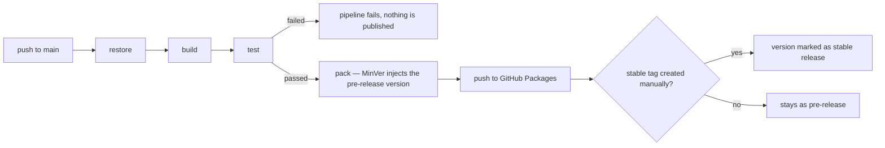

# Versioned publishing of Limaj.Framework.* packages (feed + pipeline)

**Status:** Done (implementation — functional sign-off is the user's decision)
**Última revisão:** 2026-09-13

## Context

Today `packages/Limaj.Framework.*` has no distribution mechanism at all: no `.csproj`
declares `PackageId`/`GeneratePackageOnBuild`, there is no `nuget.config`, and there is no
real CI/CD workflow at the repository root (the workflows under
`template-backend/.github/workflows/` are `echo "TODO"` placeholders, scoped to a product
copied from the template, not to the framework itself). The only real product built from
this framework (`FinanceFlow`) doesn't reference `Limaj.Framework.*` at all — it
reimplemented everything in parallel, which is exactly the problem this epic exists to
solve: allow future products to consume the framework as a versioned dependency, instead
of reimplementing it.

The user brought the proposal to `/flow`: publish the 4 packages automatically on every
push to `main`. `/arquiteto` and `/analyst`, consulted independently, converged on a more
specific proposal than the original wording — the analyst challenged "publish on every
push" for implicitly promising a stability guarantee the repository had no basis to
support (zero tests at the time), and the architect responded with concrete versioning,
feed, and sequencing decisions that resolve that objection without abandoning the original
idea.

## Architectural decisions

- **DA-001 — Feed: GitHub Packages (NuGet), not `nuget.org`, not Azure Artifacts.** No
  additional cost (we're already on GitHub, GitHub Actions would already exist),
  authentication uses the workflow's native `GITHUB_TOKEN` (no need to generate/rotate a
  dedicated API key). Public `nuget.org` was ruled out at this stage for being a public and
  practically irreversible commitment (packages can't be deleted, only "unlisted") for a
  package name that today has zero real consumers — publicly reserving `Limaj.Framework.*`
  before validating the format with a first consumer is premature optimization with a high
  reversal cost. Accepted trade-off: GitHub Packages requires authentication even for
  reads, even on a public repository — each consumer product needs a `read:packages` PAT.

- **DA-002 — Lockstep versioning across the 4 packages, via MinVer + Git tag.** The 4
  packages always ship with the same version number (one `vX.Y.Z` tag per release),
  automatically derived by MinVer from the nearest tag — no dedicated config file, no extra
  tool (GitVersion was ruled out for bringing configuration power not justified here).
  Independent per-package versioning (the SemVer-"correct" approach, given that
  `Application`/`Persistence.EFCore`/`Functions` depend on `Abstractions`) was ruled out at
  this stage for solving a problem that doesn't exist yet — there is no real consumer that
  needs to pin one package without dragging the other three along. **Reopening trigger:**
  the first real consumer that needs independent pinning between the packages.

- **DA-003 — Publish semantics: automatic pre-release + manual stable tag.** Every merge
  into `main` generates a pre-release package (e.g. `1.2.0-ci.<sha>`, via MinVer). A
  "stable" version is only published when someone manually cuts an annotated tag. There is
  no expectation of auto-update via a floating version range — the consumption model is
  pinned version, deliberate upgrade. This resolves `/analyst`'s objection about "every
  commit on main becomes something installable and presumed safe" without abandoning the
  user's original request (continuous feedback on every push) — the continuous feedback
  becomes pre-release, not a promise of stability.

- **DA-004 — 5-stage pipeline, each conditional on the previous one.**
  `restore → build → test → pack → push`. The `test` stage is blocking and **cannot be
  bypassed** — see Related, it depends on Phase 2 of
  `test-foundation-and-persistence-error-fixes.md`. Triggers on `push` to `main`
  (pre-release) and on `push` of a `vX.Y.Z` tag (stable release, see DA-006) — never on
  `pull_request`/`pull_request_target`, to avoid exposing a write token to a workflow
  running fork code. `GITHUB_TOKEN` scoped to `packages: write` restricted to the publish
  job (the minimum permission-scoping unit in GitHub Actions — there's no per-step
  permission), never to the whole workflow. Third-party actions pinned by SHA, not by a
  floating tag.

- **DA-005 — Sequencing with other epics.** This epic **cannot** reach Phase 2
  (first real publish) before:
  1. `docs/epics/backlog/test-foundation-and-persistence-error-fixes.md` (that epic's
     Phase 2 — test foundation) is complete. Without it, publishing distributes as
     "verified" something that was only compiled.
  2. `docs/epics/backlog/rename-functions-to-web.md` is complete. Renaming a package
     after it's published is an order of magnitude more expensive (a package name is, in
     practice, permanent on any feed) than before. See DA-005 of that epic, updated
     alongside this decision.

- **DA-006 — Stable tag cut trigger: manual discretion, no formal gate.** User decision
  (not settled by `/arquiteto`/`/analyst`, since it's purely process): there is no
  mandatory checklist nor third-party approval before someone cuts a `vX.Y.Z` tag — it's
  up to whoever is cutting it. This reopens the possibility of future review (e.g.,
  requiring `/qa` sign-off) if the lack of a gate causes a real incident; it is not
  auto-triggered by commit convention (that would reopen DA-003, which deliberately kept
  the tag cut manual).

## Proposed structure by layer

```
.github/workflows/
  publish-packages.yml    (new — the only workflow at the repo root; do NOT confuse with
                            the placeholders under template-backend/.github/workflows/,
                            which remain out of scope)

packages/
  Limaj.Framework.Abstractions/Limaj.Framework.Abstractions.csproj   (+ PackageId, MinVer)
  Limaj.Framework.Application/Limaj.Framework.Application.csproj     (+ PackageId, MinVer)
  Limaj.Framework.Persistence.EFCore/...csproj                       (+ PackageId, MinVer)
  Limaj.Framework.Functions/...csproj  (or Web/...csproj, if the rename is already done — PackageId, MinVer)
```

Pipeline diagram:



## Test strategy

This epic doesn't add testable domain logic by itself — the test net that validates what
is published is the responsibility of the `test-foundation-and-persistence-error-fixes.md`
epic (that epic's Phase 2 is a blocking prerequisite here, not duplicated here). What this
epic tests is the publishing mechanism itself:

- Manual/documented test of the workflow: a test push on a feature branch (not reaching
  `main`) must not trigger a publish — only simulate the stages up to `pack`.
- Validation that the pipeline fails and never reaches `pack`/`push` when `test` fails
  (a smoke test of the pipeline itself, not of the framework's code).
- Validation that the generated pre-release version actually matches the commit SHA (traceability).

## Implications and trade-offs

- Lockstep means an isolated change in `Persistence.EFCore` forces a version bump
  in `Abstractions` too, even without any change there — changelog noise accepted as cheap
  while there's no real consumer.
- GitHub Packages requiring auth for reads pushes operational cost onto each consumer
  product (managing a PAT) — acceptable because those products are already administered by
  the same team, not anonymous internet consumers.
- `template-backend/` remains outside `Limaj.Framework.sln` and outside this pipeline — no
  real workflow is added to `template-backend/.github/workflows/` as a side effect of this
  epic.

## Security implications

- `GITHUB_TOKEN` scoped to `packages: write` only on the publish job/step, never on the
  whole workflow.
- Trigger restricted to `push` on `main` — never `pull_request`/`pull_request_target`
  (avoids exposing a write token to fork code).
- Consumption uses a fine-grained PAT scoped only to `read:packages`, no `write`, stored as
  a secret in the consumer repository — never in plain text.
- `nuget.org` was also ruled out for security reasons: a push API key with global reach has
  a larger blast radius (a leak allows publishing a malicious version publicly to any
  consumer in the world) than a job-scoped, short-lived `GITHUB_TOKEN`.
- No product/domain secret is introduced — the packages remain free of business rules
  (guardrail from `CLAUDE.md`), so the published content carries no risk of exposing
  proprietary logic.

## Next steps

1. Confirm `test-foundation-and-persistence-error-fixes.md` (Phase 2) is complete before
   starting this epic's Phase 2.
2. Confirm `rename-functions-to-web.md` is complete before the first real publish.
3. `/spike` implements Phase 2 (workflow + MinVer + PackageId in the 4 `.csproj`).

## Phase checklist

### Phase 1 — Decisions (closed in this session, recorded above as DA-001 to DA-005)
- [x] Feed choice (DA-001)
- [x] Versioning scheme (DA-002)
- [x] Publish/pre-release semantics (DA-003)
- [x] Pipeline design (DA-004)
- [x] Sequencing with the test and rename epics (DA-005)

### Phase 2 — Contained implementation: pipeline publishing pre-release to a private feed
- [x] Confirm `test-foundation-and-persistence-error-fixes.md` (Phase 2) is complete —
      already in `docs/epics/finalizados/`, all items of that epic's Phase 2 marked `[x]`.
- [x] Confirm `rename-functions-to-web.md` is complete — already in
      `docs/epics/finalizados/` (commit `02186c6`); the 4 `.csproj` already reflect
      `Limaj.Framework.Web`.
- [x] Add `PackageId` + a reference to the `MinVer` package in the 4 `.csproj` — `MinVer`
      8.0.0 (`PrivateAssets=all`), an explicit `PackageId`, and `MinVerTagPrefix=v`
      (consistent with DA-002's `vX.Y.Z` tag format) in
      [Abstractions.csproj](../../../packages/Limaj.Framework.Abstractions/Limaj.Framework.Abstractions.csproj),
      [Application.csproj](../../../packages/Limaj.Framework.Application/Limaj.Framework.Application.csproj),
      [Persistence.EFCore.csproj](../../../packages/Limaj.Framework.Persistence.EFCore/Limaj.Framework.Persistence.EFCore.csproj),
      [Web.csproj](../../../packages/Limaj.Framework.Web/Limaj.Framework.Web.csproj).
- [x] Create `.github/workflows/publish-packages.yml` (restore→build→test→pack→push) — two
      jobs (`build-test-pack` and `publish`, `needs: build-test-pack`) so that
      `packages: write` stays restricted to only the publish job (steps have no permission
      scope of their own in GitHub Actions — job is the minimum unit), never the whole
      workflow. Trigger `on: push: branches: [main]` — never `pull_request`/
      `pull_request_target`. Third-party actions (`checkout`, `setup-dotnet`,
      `upload-artifact`, `download-artifact`) pinned by commit SHA, not a floating tag.
      `dotnet test` runs before `pack`/`push` and blocks the job if it fails (GitHub
      Actions' standard sequential-step behavior). The commit's short SHA is injected via
      `-p:MinVerBuildMetadata=sha.<7-chars>` during `pack`, to trace the pre-release back to
      its source commit.
- [x] Configure the repository's GitHub Packages feed + scoped `GITHUB_TOKEN` — feed
      `https://nuget.pkg.github.com/limajsolutions/index.json`; `permissions: packages: write`
      only on the `publish` job; the rest of the jobs/workflow use `permissions: contents: read`.
- [x] Validate: a push to a feature branch does not publish; a push to `main` generates a
      correctly versioned pre-release — the branch restriction is structural (`on: push:
      branches: [main]`; GitHub Actions never triggers this workflow for a push on another
      branch). Versioning validated locally: `dotnet build` (0 errors) and `dotnet test`
      (78/78 passing) in full, and `dotnet pack` with no Git tag yet created in the repo
      produced `Limaj.Framework.*.0.0.0-alpha.0.4.nupkg` for the 4 packages — confirming
      MinVer computes the version from the history height with `MinVerTagPrefix=v`, ready to
      resolve real `X.Y.Z` versions as soon as the first `vX.Y.Z` tag exists (Phase 3).

### Phase 3 — Promotion to stable
- [x] Define and document the stable tag cut procedure — DA-006 closed by the user in this
      session: manual discretion, no formal gate. Mechanism documented in the
      [README](../../../README.md#publishing-the-packages-limajframework) (`git tag -a vX.Y.Z -m
      "..." && git push origin vX.Y.Z`); the workflow was updated to also trigger on `push`
      of a `v[0-9]+.[0-9]+.[0-9]+` tag (previously it only triggered on `push` to `main`),
      since without that additional trigger, cutting a tag on an already-merged commit
      wouldn't rebuild/republish the package as a stable version — validated locally
      (disposable local tag): MinVer resolves the exact tag version with no pre-release
      suffix even with `MinVerBuildMetadata` set (the metadata is only appended when the
      height above the tag is > 0).
- [x] Define the incident/yank procedure for a bad version — documented in the
      [README](../../../README.md#incident-bad-version-published): publish the fixed version
      with a new tag (never reuse a number), remove the bad version via GitHub Packages (real
      deletion, unlike `nuget.org`'s "unlist" — see DA-001), notify consumers.
- [x] Only consider a public feed (`nuget.org`) if and when there's real demand from a
      consumer outside the team — no action needed now; the decision is recorded in the
      README as a reminder for when that trigger occurs.

## Open decisions

> Pending decision: DA-007 — the objective trigger for migrating from lockstep versioning
> to independent per-package versioning. Proposed: the moment a first real consumer needs
> to pin one package without dragging the other three along. Not closed as a formal
> criterion.

## Related

- **Depends on** `docs/epics/backlog/test-foundation-and-persistence-error-fixes.md` (Phase 2) —
  a blocking prerequisite before any real publish.
- **Depends on** `docs/epics/backlog/rename-functions-to-web.md` — must complete before the
  first real publish (see DA-005 of that epic, updated alongside this one).
- Technical investigation that grounded the original discussion: `Limaj.Framework.*` vs.
  `FinanceFlow` comparison (`/flow` session, 2026-09-12).
